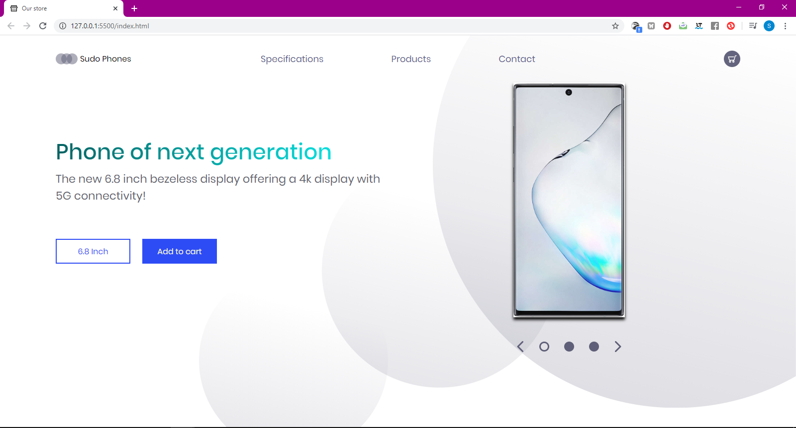
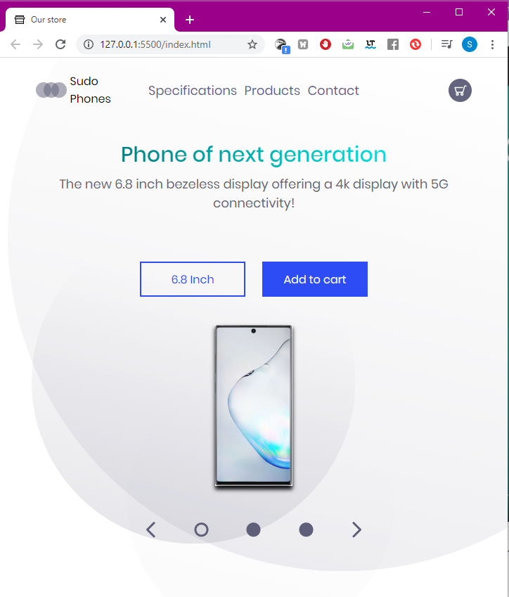

# Phone-store
Simple responsive *HTML* page, I added some responsivity to the *HTML* page with *CSS* to support screens less than ***1024*px** width. 
But the navbar is not fully responsive for smallest screens.
Here it is for desktop screens :

     
And here it is how it displays in **narrower** screens (< ***1024*px**) :

